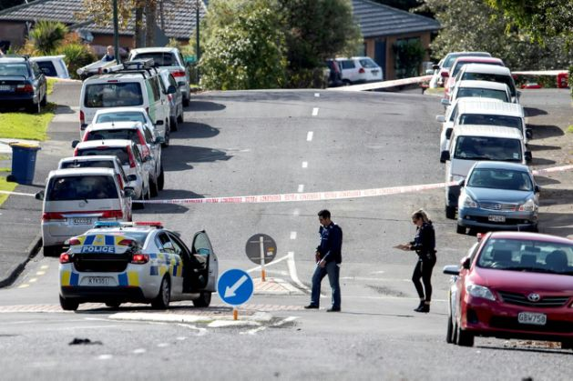

# 108-2-S0727120-P3
p3
<html>
<head>
<title>期末作業-3</title>
</head>
<body bgcolor="#CD8500">
<h1>紐西蘭罕見 一警交通攔檢遭槍擊喪命</h1>

<h3>（法新社威靈頓19日電）</h3>

紐西蘭一名無武裝警察今天在奧克蘭街頭遭槍擊殉職，這是紐西蘭至少10年來第一次有警察在值勤中遭受致命槍傷而喪命。 
紐西蘭總理阿爾登（Jacinda Ardern）說，此案「令人震驚」。

警方表示，兩名警察在例行交通攔檢時，攔下一輛載有兩人的車，車上一人開槍，造成一名警察死亡，另一人腿部重傷； 
槍手駕車逃逸時，另造成一名路人被撞受傷，已送醫住院。警方正迫切追蹤嫌疑人下落。

警政署長柯斯特（Andrew Coster）表示，「我們的警員每天承擔的就是這類工作，以維護大眾安全」， 
現階段，沒有跡象顯示這類工作會需要任何特殊配置。

柯斯特不願臆測槍手開火動機。

去年，基督城（Christchurch）清真寺發生槍擊案，奪走51名穆斯林性命，自那之後，紐西蘭就緊縮槍械管制相關法律。

紐西蘭國會昨天才剛通過立法，進一步管制槍枝。

</body>

</html>
